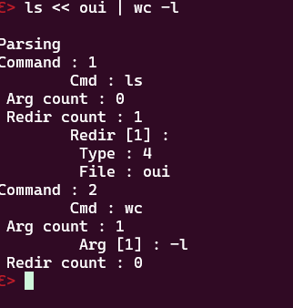

# so_long ✅101/100
A simple Bash

- 

I did this project with Tuvosyl
- 

This project pass the minishell tester of LucasKuhn :
- 

This project use the readline function, causing some leaks and weirds issues in the code, to fix the leaks, use :
```shell
valgrind --suppressions="rl.supp" ./minishell
```

We didn't use a tokeniser for minishell, instead we made our own algorythm :
The program is divided in 4 parts :
  - Reading
  - Checking
  - Parsing
  - Executing
(Keep in mind that I did the checking/parsing parts and Tuvosyl did the reading/executing/leaks parts so I might not explain well his parts)

## Reading
The reading part is very small, as it only contain the readline function.

## Checking
The checking part verify the command put in the readline function, if the command 
  - have unclosed quotes,
  - have unclosed pipes,
  - have unclosed redirection,
then the program return to the reading part.

This part is very usefull for later as in the parsing you'll have the garanty of a valid command.

## Parsing
The parsing part parse the command into a command struct like this :
  - It split the command string with the pipes,
  - It set the environment variables if there's any,
  - It parse the redirections and remove them from the string,
  - It split the last inputs with the whitespaces in a list as they are the command and arguments.

At the end of the parsing it look like this :



## Executing
The executing part is the final part, it take the command list and must comport exactly like bash :
  - If there is heredocs, it add another readline and work like bash,
  - If there is redirections, it change the fd of the command according the redirection,
  - If there is pipes, it fork the process to get a pipeline with the result of the command being put into the pipe for the next command input,
  - Then if the command is a builtins, it enter in the correct command function instead of doing the binary file (it should work without PATH),
  - Else, it do the access/execve commands with the PATH.


To use the program, you must do these commands :
```shell
cd minishell
make

# Program :
./minishell

# Tester  :
cd minishell
make
cd minishell_tester
./tester
```

There's also a debug mode for this program, to use it you must use :
```shell
make debug
```
(/!\ Keep in mind the debugger is only for understanding the parsing and can cause unexpected behavior as it's not mandatory /!\)

You also have these commands for cleaning the minishell directory :
```shell
# Clean all object files (*.o)
make clean

# Clean executable & object files
make fclean

# Clean everything and recompile the executable
make re
```
